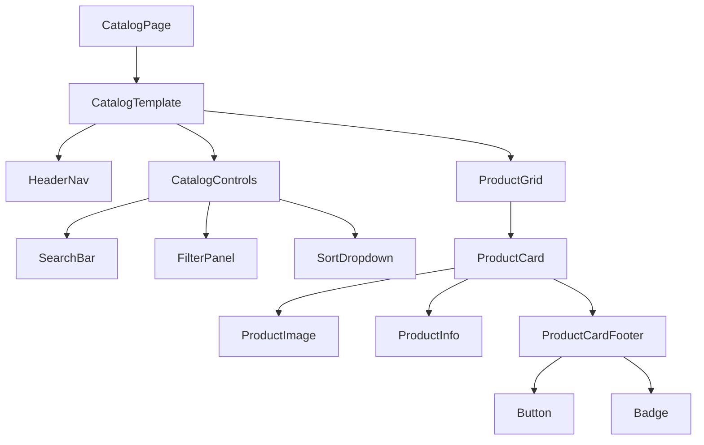

# Component Architecture — Product Catalog

The Product Catalog follows Atomic Design principles to ensure reusability, scalability, and consistency.

---

## Component Hierarchy Diagram

---

## Page Level

### CatalogPage
Responsible for:
- Fetching listings from API
- Managing query parameters
- Passing data into template

---

## Template Level

### CatalogTemplate
Defines layout structure:
- Header
- Controls
- Grid section

---

## Organisms

### HeaderNav
Global navigation bar

### CatalogControls
Search, filter, and sorting controls

### ProductGrid
Responsive grid layout for listing cards

---

## Molecules

- SearchBar
- FilterPanel
- SortDropdown
- ProductCard
- ProductCardFooter

---

## Atoms

- Button
- Input
- Select
- Badge
- Card
