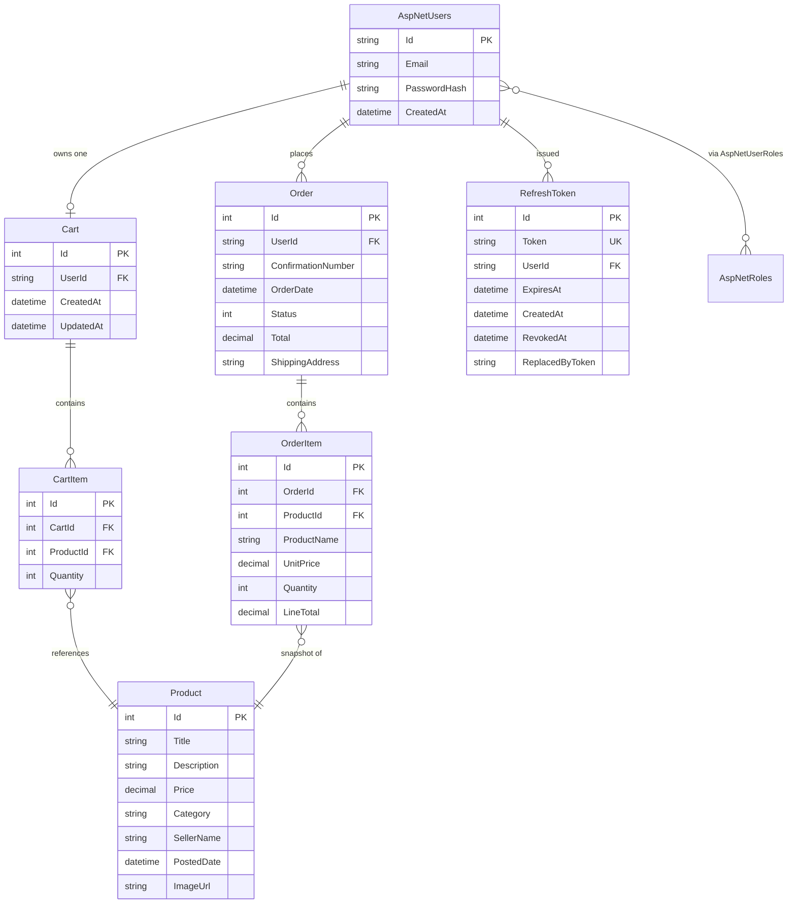

# Database Schema (Updated for Milestone 6)

This document reflects the database schema as it actually shipped. The
Milestone 1 ERD imagined messaging, reviews, and reports; the scope landed
on a marketplace **catalog + cart + order + auth** flow, which is what's
modeled here.

The schema is migration-driven. Source of truth: `api/Migrations/`.
EF Core runs `Database.MigrateAsync()` on startup.

---

## Entities (shipped)

| Entity            | File                                     | Notes                                                       |
|-------------------|------------------------------------------|-------------------------------------------------------------|
| `ApplicationUser` | `api/Models/ApplicationUser.cs`          | Subclass of `IdentityUser`; backs `AspNetUsers`.            |
| `IdentityRole`    | (framework)                              | Two seeded roles: `Admin`, `User`.                          |
| `Product`         | `api/Models/Product.cs`                  | Marketplace listing.                                        |
| `Cart`            | `api/Models/Cart.cs`                     | One per user; `UserId` ties to `AspNetUsers`.               |
| `CartItem`        | `api/Models/CartItem.cs`                 | Line item in a cart, references `Product`.                  |
| `Order`           | `api/Models/Order.cs`                    | Created from a cart at checkout; carries `OrderStatus` enum.|
| `OrderItem`       | `api/Models/OrderItem.cs`                | Snapshot of cart contents at order time.                    |
| `RefreshToken`    | `api/Models/RefreshToken.cs`             | Persists refresh tokens for rotation + revocation.          |

---

## Entity-Relationship Diagram

---

## Notes on the design

- **`OrderItem` snapshots `ProductName`, `UnitPrice`, and `LineTotal`** at
  the moment the order is placed, so editing or deleting a `Product`
  later does not corrupt historical orders.
- **`RefreshToken.Token` is unique-indexed** so token reuse can be
  detected; revoking sets `RevokedAt` (and `ReplacedByToken` on rotation)
  rather than deleting the row, so we keep an audit trail.
- **Identity tables** (`AspNetUsers`, `AspNetRoles`, `AspNetUserRoles`,
  `AspNetUserClaims`, `AspNetUserLogins`, `AspNetUserTokens`,
  `AspNetRoleClaims`) are created by the
  `Microsoft.AspNetCore.Identity.EntityFrameworkCore` migration. Two roles
  (`Admin`, `User`) are seeded in `OnModelCreating`; an admin and a regular
  test user are seeded by `SeedData.cs` on first run.
- **The schema is provider-agnostic.** It runs on SQLite locally
  (`api/BuckeyeMarketplace.db`) and Azure SQL in production via the same
  EF Core model.
