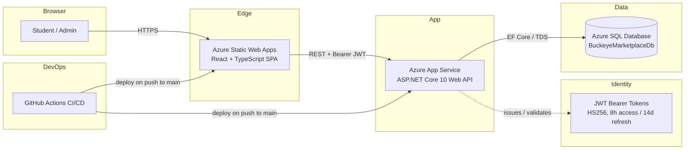

# System Architecture (Updated for Milestone 6)

## Overview

Buckeye Marketplace is a full-stack marketplace web app for Ohio State
students. The architecture is a classic three-tier SPA + REST API
deployment, hosted on Azure, with a clear split between presentation,
application, and data layers.

This document supersedes the Milestone 1 sketch and reflects the system as
it actually shipped through Milestones 3–6.

---

## High-Level Architecture (production)

---

## Architectural Layers

### 1. Presentation Layer (frontend)
- **React 19 + TypeScript**, built with Vite, hosted on Azure Static Web
  Apps.
- Client-side routing via React Router 7. `staticwebapp.config.json`
  rewrites unknown paths to `/index.html` so deep links survive refresh.
- Auth state lives in a `useReducer`-based `AuthContext`; the JWT and
  refresh token are stored in `localStorage`.
- Every API call goes through a single `apiFetch` helper that injects the
  bearer token, transparently retries once after a silent refresh on 401,
  and surfaces typed `ApiError`s to UI components.
- Protected routes (`/cart`, `/checkout`, `/orders`, `/admin/*`) are
  gated client-side with a `<ProtectedRoute>` component, but every
  protection is also enforced server-side.

### 2. Application Layer (backend)
- **ASP.NET Core 10 Web API**, hosted on a Linux Azure App Service.
- Controllers per resource: `AuthController`, `ProductsController`,
  `CartController`, `OrdersController`. Business logic that doesn't belong
  in a controller (`OrderCalculator`, `JwtTokenService`, `PasswordRules`)
  lives in `Services/` so it can be unit-tested in isolation.
- **Authentication** via ASP.NET Core Identity + `JwtBearer`. The signing
  key is read from `Jwt:Key` (App Service application setting in
  production, `dotnet user-secrets` locally). Startup throws if the key is
  missing.
- **Authorization** is two-tier: `[Authorize]` for any logged-in user,
  `[Authorize(Roles = "Admin")]` for admin endpoints. User-scoped queries
  always read the user id from `ClaimTypes.NameIdentifier` on the JWT —
  never from the URL or body — to defend against broken-object-level
  authorization (OWASP API1).
- **Validation** uses FluentValidation; request DTOs have explicit
  validators (`AddToCartRequestValidator`, `UpdateCartItemRequestValidator`,
  etc.).
- **Security headers** (`X-Content-Type-Options`, `X-Frame-Options`,
  `Referrer-Policy`) are added by middleware. HTTPS redirect is enabled in
  non-Development environments.
- **CORS** is configured in `Program.cs`; the production frontend origin
  is added via the `Cors:AllowedOrigins` configuration array, not by code
  changes.

### 3. Data Layer
- **Azure SQL Database** in production; **SQLite** for local development
  (so contributors don't need an Azure connection to run the app).
- Access goes through Entity Framework Core 10 LINQ — no `FromSqlRaw`,
  no string-interpolated SQL anywhere.
- Schema is migration-driven (`api/Migrations/`); the API runs
  `db.Database.MigrateAsync()` on startup so production stays in sync.
- Identity tables (`AspNetUsers`, `AspNetRoles`, `AspNetUserRoles`, etc.)
  live in the same database alongside the domain tables; this is a
  conscious tradeoff to keep things simple for a class project.

### 4. DevOps Layer
- **CI/CD**: three GitHub Actions workflows in `.github/workflows/`.
  - `ci.yml` — build + test on every push and PR (gate for `main`).
  - `deploy-api.yml` — builds, tests, publishes, and deploys the .NET API
    to App Service via the Azure publish profile.
  - `deploy-frontend.yml` — runs Vitest, builds the production bundle,
    and deploys to Azure Static Web Apps via the SWA token.
- **Tests gate every deploy.** Both deploy workflows refuse to ship if
  `dotnet test` or `npm test -- --run` fails.

---

## Key Request Flows

### Login → protected request
1. Browser → `POST /api/auth/login` with email + password.
2. API verifies via `UserManager.CheckPasswordAsync`; on success issues
   a signed JWT and a refresh token, persists the refresh token row.
3. Frontend stores both tokens in `localStorage`.
4. All subsequent requests carry `Authorization: Bearer <jwt>`. On `401`,
   `apiFetch` calls `POST /api/auth/refresh` once, gets a new pair, and
   replays the original request.

### Place an order
1. `POST /api/orders` with the shipping address (auth required).
2. Controller reads the user id from the JWT, loads that user's cart,
   computes line totals via `OrderCalculator`, persists `Order` +
   `OrderItem`s in a single transaction, and clears the cart.
3. Response includes the generated confirmation number.

### Admin order management
1. `GET /api/orders` (Admin role required) returns every order.
2. `PUT /api/orders/{id}/status` (Admin) updates `Order.Status`.
3. The admin SPA hits the same endpoints with the same JWT — there is no
   separate admin app.

---

## Deployment topology (production)

| Component         | Service                  | Hostname (example)                                  |
|-------------------|--------------------------|-----------------------------------------------------|
| SPA               | Azure Static Web Apps    | `https://buckeye-frontend-jama.azurewebsites.net` |
| API               | Azure App Service (Linux)| `https://buckeye-api-jama.azurewebsites.net`        |
| Database          | Azure SQL Database       | `buckeye-sql-jama.database.windows.net`             |
| CI/CD             | GitHub Actions           | `.github/workflows/`                                |

See [deployment.md](deployment.md) for the full runbook.

---

## Why this architecture

- **SPA + REST keeps the contract simple.** The frontend is a static
  bundle; cache headers and CDN-style hosting are essentially free on SWA.
- **JWT bearer auth scales horizontally.** No sticky sessions; App
  Service can scale out without a session store.
- **EF Core LINQ everywhere** removes whole classes of SQL injection
  bugs and lets the same model code run against SQLite locally and Azure
  SQL in production.
- **Tests gate deploys** so a broken `main` never ships.
- **Secrets stay out of source.** Runtime secrets live in App Service
  configuration; build-time secrets live in GitHub repository secrets;
  the application code only reads from `IConfiguration`.
