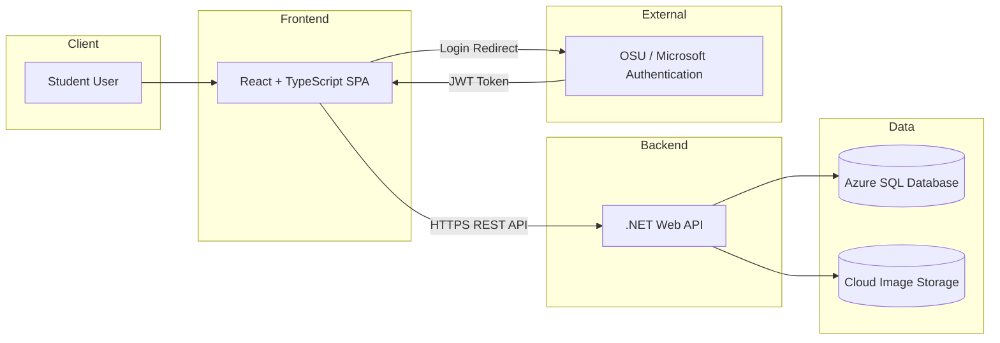

# System Architecture (High-Level)

## Overview

Buckeye Marketplace is a secure full-stack marketplace system designed for Ohio State students.  
The architecture separates responsibilities into presentation, business logic, and data layers.

---

## High-Level Architecture Diagram

---

## Architectural Layers

### 1️⃣ Presentation Layer (Frontend)
- Built with React + TypeScript
- Handles UI rendering
- Manages authentication token
- Sends REST requests to backend

### 2️⃣ Application Layer (Backend)
- Built with .NET Web API
- Contains business rules
- Validates authentication tokens
- Handles listing, messaging, reviews, reporting logic

### 3️⃣ Data Layer
- Azure SQL stores relational data
- Cloud image storage stores listing photos

---

## Why This Architecture Works

- Secure identity via OSU login
- Clean separation of concerns
- Scalable backend API
- Structured relational database
- Independent image storage for performance
